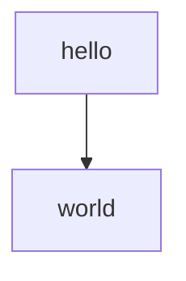

# 多语言编码规范配置文件使用说明

> 基于 SFRD-PPQA-03-6.7 编程规范
>
> 支持语言: JavaScript, C++, Shell, Python, Go
>
> 配置位置: `~/.config/nvim/`

---

## 📋 配置文件清单

### 已创建的配置文件

| 文件名                 | 用途              | 适用语言   |
| ---------------------- | ----------------- | ---------- |
| `.eslintrc.json`       | ESLint 配置       | JavaScript |
| `.prettierrc.json`     | Prettier 配置     | JavaScript |
| `.clang-tidy`          | clang-tidy 配置   | C/C++      |
| `.clang-format`        | clang-format 配置 | C/C++      |
| `.shellcheckrc`        | ShellCheck 配置   | Shell      |
| `.editorconfig`        | 编辑器配置        | 所有语言   |
| `Makefile.multilang`   | 开发命令          | 所有语言   |
| `pre-commit.multilang` | Git Hook          | 所有语言   |

---

## 🚀 快速开始

### 1. 安装工具

#### macOS

```bash
# JavaScript
npm install -g eslint prettier

# C++
brew install clang-tidy clang-format

# Shell
brew install shellcheck shfmt

# Python
pip install ruff pylint

# Go
# 参考 Go 文档安装 golangci-lint
```

#### Linux (Ubuntu/Debian)

```bash
# JavaScript
sudo npm install -g eslint prettier

# C++
sudo apt-get install clang-tidy clang-format

# Shell
sudo apt-get install shellcheck
# shfmt 需要从 GitHub 安装

# Python
pip install ruff pylint
```

---

### 2. 使用 Makefile

```bash
# 复制 Makefile
cp ~/.config/nvim/Makefile.multilang ./Makefile

# 检查特定语言
make js-lint      # JavaScript 检查
make cpp-lint     # C++ 检查
make sh-lint      # Shell 检查
make py-lint      # Python 检查
make go-lint      # Go 检查

# 格式化特定语言
make js-format
make cpp-format
make sh-format
make py-format
make go-format

# 完整验证（格式化 + 检查）
make js-verify
make cpp-verify
make sh-verify
make py-verify
make go-verify

# 检查所有语言
make all

# 清理临时文件
make clean
```

---

### 3. 配置 Git Pre-commit Hook

```bash
# 复制 pre-commit hook
cp ~/.config/nvim/pre-commit.multilang .git/hooks/pre-commit
chmod +x .git/hooks/pre-commit

# 现在每次 git commit 会自动运行检查
```

或者使用 git config（推荐）：

```bash
# 在项目根目录运行
git config core.hooksPath .githooks
mkdir -p .githooks
cp ~/.config/nvim/pre-commit.multilang .githooks/pre-commit
chmod +x .githooks/pre-commit
```

---

## 📝 各语言详细说明

### JavaScript

**工具**: ESLint + Prettier

**检查规则**:

- ✅ 函数命名 ≥3 字符
- ✅ 使用 `===` 而非 `==`
- ✅ 禁止 `eval`，使用 `JSON.parse`
- ✅ 函数长度 ≤100 行
- ✅ 单页面模式禁止全局变量

**使用方法**:

```bash
# 检查
eslint . --ext .js,.jsx

# 自动修复
eslint . --ext .js,.jsx --fix

# 格式化
prettier --write "**/*.{js,jsx}"
```

---

### C++

**工具**: clang-tidy + clang-format

**检查规则**:

- ✅ 成员初始化
- ✅ explicit 使用
- ✅ 虚析构函数
- ✅ 资源管理
- ✅ 智能指针使用

**使用方法**:

```bash
# 检查
clang-tidy file.cpp --config-file=~/.config/nvim/.clang-tidy

# 格式化
clang-format -i file.cpp

# 检查整个项目
find . -name "*.cpp" | xargs clang-tidy
```

---

### Shell

**工具**: ShellCheck + shfmt

**检查规则**:

- ✅ 函数长度 ≤50 行
- ✅ 参数使用有意义的变量名
- ✅ 字符串比较使用双引号
- ✅ 防止注入攻击
- ✅ 检查命令返回值

**使用方法**:

```bash
# 检查
shellcheck script.sh

# 格式化
shfmt -w script.sh

# 检查所有脚本
find . -name "*.sh" -exec shellcheck {} \;
```

---

### Python

**工具**: Ruff + Pylint (已配置)

**检查规则**:

- ✅ 77 项检查
- ✅ 风格、导入、安全
- ✅ 并发、国际化

**使用方法**:

```bash
# Ruff 检查
ruff check --config=~/.config/nvim/ruff_company.toml .

# Ruff 格式化
ruff format --config=~/.config/nvim/ruff_company.toml .

# Pylint 检查
pylint --rcfile=~/.config/nvim/.pylintrc .
```

---

### Go

**工具**: golangci-lint + gofmt (已配置)

**检查规则**:

- ✅ 56 项检查
- ✅ 风格、错误处理、并发

**使用方法**:

```bash
# golangci-lint 检查
golangci-lint run --config=~/.config/nvim/.golangci.yml

# gofmt 格式化
gofmt -w -s .
```

---

## 🔧 配置文件详解

### .editorconfig

统一的编辑器配置，支持：

- UTF-8 编码
- LF 换行
- 4 空格缩进（Go 用 Tab）
- 自动去除行尾空格
- 文件末尾添加换行

**支持的编辑器**:

- VSCode
- Vim/Neovim
- JetBrains IDE
- Sublime Text
- Atom
- 等等

---

### .eslintrc.json

ESLint 配置，映射到 SANGFOR JavaScript Checklist：

- 1.  style: 命名、缩进、注释、代码行数、大括号
- 2.  exception: 外部输入、参数检查、返回值检查
- 3.  practice: `===`、变量定义、eval 使用
- 4.  extjs: 全局变量控制

---

### .clang-tidy

clang-tidy 配置，映射到 SANGFOR C++ Checklist：

- 1.  构造与析构 (10 项)
- 2.  C++异常 (3 项)
- 3.  C++类 (4 项)
- 4.  C++模板 (3 项)
- 5.  运算符重载 (2 项)
- 6.  C++标准库 (9 项)

---

### .shellcheckrc

ShellCheck 配置，映射到 SANGFOR Shell Checklist：

- 1.  style: 命名、缩进、注释、代码行数、参数命名
- 2.  exception: 参数检查、数据检查、返回值检查
- 3.  spec: 局部变量、字符串比较、条件测试、管道、防注入

---

## 📚 相关文档

编码规范分析报告位置：

```
~/GoogleDrive/Note/leo's note/sangfor/编码checklist/
├── javascript.md  ✅
├── cpp.md          ✅
├── shell.md        ✅
├── python.md       ✅ v2.0
└── golang.md       ✅
```

---

## 🤝 团队协作

### 新成员加入

1. 安装工具（见上文第1节）
2. 复制配置文件
3. 运行 `make all` 测试
4. 配置 Git Hooks
5. 阅读编码规范文档

### CI/CD 集成

在 CI 中运行：

```yaml
- make all
```

或分别运行：

```yaml
- make js-verify
- make cpp-verify
- make sh-verify
- make py-verify
- make go-verify
```

---

## ❓ 常见问题

### Q: 配置文件不生效？

A: 检查文件路径：

- ESLint: 项目根目录或 `~/.eslintrc.json`
- clang-tidy: 使用 `--config-file` 参数指定
- ShellCheck: 项目根目录或 `~/.shellcheckrc`
- EditorConfig: 项目根目录自动查找

### Q: 某些规则需要忽略？

A: 可以在代码中使用注释忽略：

**JavaScript**:

```javascript
// eslint-disable-next-line no-eval
eval(someCode);
```

**C++**:

```cpp
// NOLINTNEXTLINE
int x = 42;
```

**Shell**:

```bash
# shellcheck disable=SC2001
echo "$(cmd)"
```

### Q: 想自定义规则？

A: 编辑对应的配置文件：

- `.eslintrc.json`: 修改 rules
- `.clang-tidy`: 修改 Checks 和 CheckOptions
- `.shellcheckrc`: 修改 ignore 规则

---

**更新日期**: 2026-01-17
**版本**: v1.0


